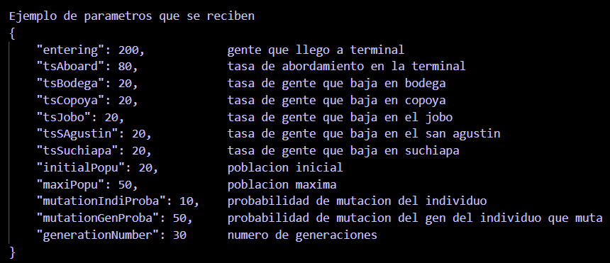
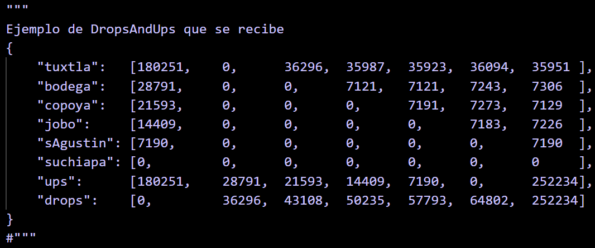

# AplicativeAG

El sigiente documento es explicativo y tiene la intencion de presentar al algoritmo genetico orientado a un problema real por lo tanto no contiene pasos ni instrucciones de uso sino el contexto de la forma de trabajo del algoritmo.

Para ver el instructivo de uso dirijase al archivo: [Instructions](Instructions.md "Instructions.md")

## DALGOS como base, AlgoGen como referencia

DALGOS no es mas que un nombre para la forma base en que se implementa el algoritmo, no es algun tipo de proyecto ni nada parecido. La caracteristica principal en la estructura de DALGOS es separar partes del codigo que sirven para diferentes cosas, se destacan entre ellas:

1. Archivo de Ejecucion (main)
2. Archivo de Emparejamiento
3. Archivo de Cruza
4. Archivo de Mutacion
5. Archivo de Poda
6. Archivo de Graficas
7. Carpeta de salidas jsons

Por otro lado AlgoGen, si es un proyecto que aplica un algoritmo genetico que aplica a DALGOS como estructura para una problematica ficticia en la que se optimiza un valor. En dicho proyecto podremos identificar las 7 caracteristicas mas destacables de DALGOS.

Para mas detalles del proyecto AlgoGen (y la primera implementacion de DALGOS) dirijase a: [AlgoGen Project](https://github.com/JossAnn/AlgoGen.git "https://github.com/JossAnn/AlgoGen.git")

### Lanzamiento de parametros:

1. La cantidad de gente que llega a la terminal
2. la tasa de gente que se subirá los colectivos
3. Tasa de movimiento en bodega
4. Tasa de movimiento en copoya
5. Tasa de movimiento en el jobo
6. Tasa de movimiento en san agustin
7. Tasa de movimiento en suchiapa
8. Parametros ocultos:
   1. Poblacion Inicial
   2. Poblacion maxima
   3. Probabilidad de mutacioon del individuo
   4. Probabilidad de mutacion del gen
   5. Numero de generaciones

#### Manejo de entrada y tasas

##### Puntos: 1, 2.

Para la cantidad de gente, es eso, solo un numero de gente que va a llegar a la terminal pero que no sabemos todavia cuantas abordarán, la tasa de abordaje es el porcentaje de gente que entrará, pero o se normaliza con el fin de no tener una constante sino que se generan numeros random del 0 al 100 y si son menores o iguales que la tasa abordan, de lo contrario simplemente no se toman en cuenta.

##### Puntos: 3, 4, 5, 6, 7.

Estas tasas si se normalizan en funcion de cuantas personas abordan el colectivo por lo tanto representan porcentajes de las bajadas que harán las personas que aborden un colectivo.

##### Puntos: 8.

Los parametros ocultos son para que el algoritmo funcione, aun no se con certeza como deberia usarlos o aplicarlos en el individuo ya que no etá definido, pero lo explicaré con forme vaya avanzando.

1. La poblacion inicial es la cantidad de individuos de donde se empezará a hacer la cruza (debe ser generacion aleatoria de individuos).
2. El limite de individuos por generacion
3. Es la probabilidad de que un individuo mute o no lo haga
4. Con los genes del individuo que mutará se elije una probabilidad para determinar si cada uno de sus genes muta o no
5. Cantidad de generaciones para el algoritmo

### Drops And Ups

#### Drops

Los Drops son las personas que se bajan en cada parada.

1. Los Drops varian en funcion del total de personas que abordaron y las tasas de movimiento de cada parada.
2. El Dropeo de personas es directamente proporcional al movimiento de la parada, sin embargo, no es exacto, pues las proporciones se guian de valores random.

#### Ups

Los Ups son las personas que se suben en cada parada.

1. Los Ups al igual que los drops, dependen de la tasa de movimiento de la parada pero varia en que no toma al abordaje total de personas para calcularse.
2. En cada parada se van restando al total de personas abordadas las personas que ya bajaron. Es decir al abordaje total se le van restando los Dropeos de cada parada y al obtener esta nuebo numero de personas, se calcula la cantidad de gente que se convierte en un Up con ayuda de la tasa de movimiento,

jgv
